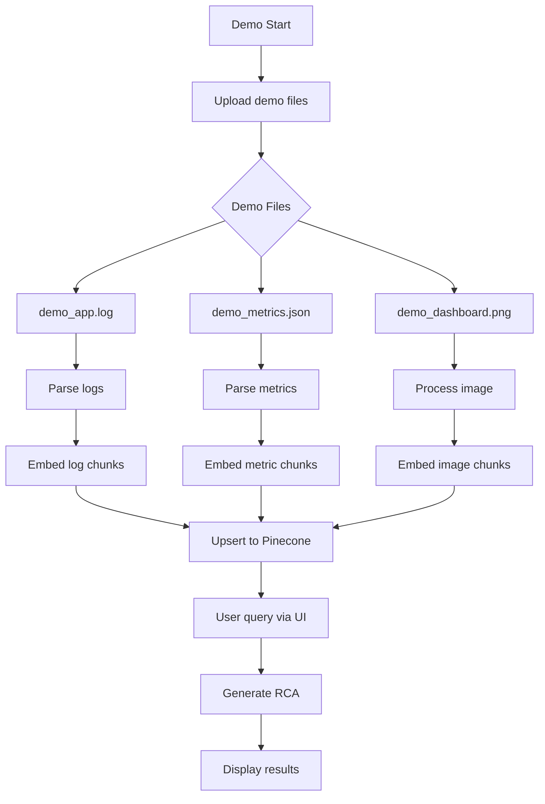

# LogMind RCA Flow Diagram

```mermaid
graph TD
    DemoStart[Demo Start] --> Upload[Upload demo files]
    Upload --> Files{Demo Files}
    Files --> LogFile[demo_app.log]
    Files --> MetricsFile[demo_metrics.json]
    Files --> ImageFile[demo_dashboard.png]
    LogFile --> ParseLog[Parse logs]
    MetricsFile --> ParseMetrics[Parse metrics]
    ImageFile --> ProcessImg[Process image]
    ParseLog --> EmbedLog[Embed log chunks]
    ParseMetrics --> EmbedMetrics[Embed metric chunks]
    ProcessImg --> EmbedImg[Embed image chunks]
    EmbedLog --> Index[Upsert to Pinecone]
    EmbedMetrics --> Index
    EmbedImg --> Index
    Index --> Query[User query via UI]
    Query --> RCA[Generate RCA]
    RCA --> Result[Display results]
```

